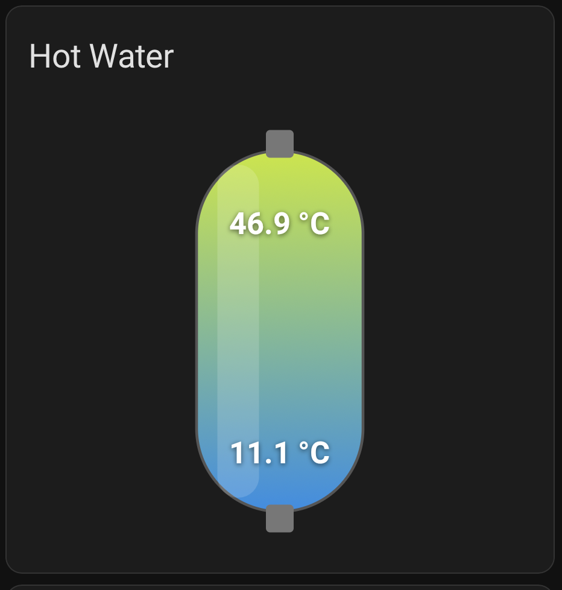

# Tank Card for Home Assistant

A custom Lovelace card that displays a hot water cylinder with a temperature gradient. If you have an extra tall (>200L) tank this shows top, optional middle, and bottom temperatures with a colour scale from blue (cold) to red (hot).



## Installation

### HACS (recommended)

1. Open **HACS** in your Home Assistant sidebar
2. Click the three-dot menu (top right) → **Custom repositories**
3. Add `https://github.com/videojedi/HA-card-tank` with category **Dashboard**
4. Click **Install**
5. Restart Home Assistant

### Manual

1. Copy `tank-card.js` to your Home Assistant `config/www/` folder
2. Add the resource in **Settings > Dashboards > Resources**:
   - URL: `/local/tank-card.js`
   - Type: JavaScript module
3. Restart Home Assistant

## Usage

```yaml
type: custom:tank-card
entity_top: sensor.hot_water_top_temperature
entity_mid: sensor.hot_water_middle_temperature
entity_bottom: sensor.hot_water_bottom_temperature
name: Hot Water
min_temp: 10
max_temp: 65
entity_boost: switch.immersion_heater
```

## Options

| Option | Type | Default | Required | Description |
|---|---|---|---|---|
| `entity_top` | string | — | Yes | Entity ID for the top temperature sensor |
| `entity_mid` | string | — | No | Entity ID for an optional middle temperature sensor — adds a third gradient stop and centre readout |
| `entity_bottom` | string | — | Yes | Entity ID for the bottom temperature sensor |
| `name` | string | `Hot Water` | No | Card title |
| `min_temp` | number | `10` | No | Minimum temperature for colour scale (°C) |
| `max_temp` | number | `65` | No | Maximum temperature for colour scale (°C) |
| `entity_boost` | string | — | No | Entity ID for boost heater toggle (e.g. `switch.*` or `input_boolean.*`) |
